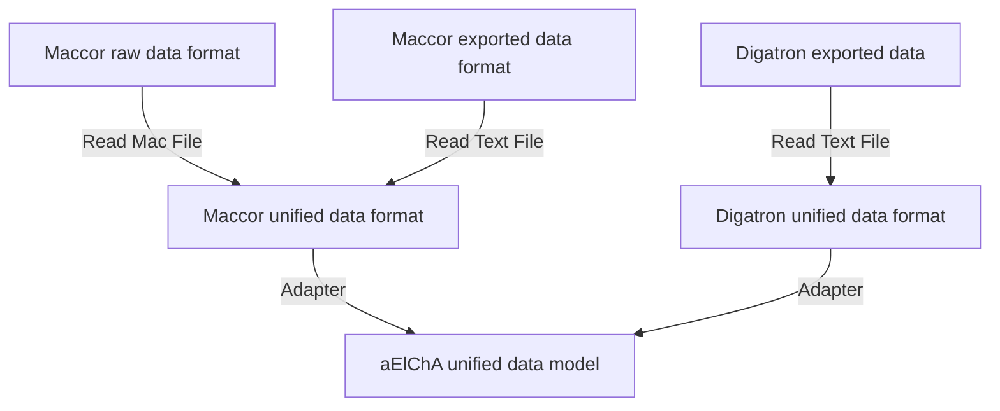
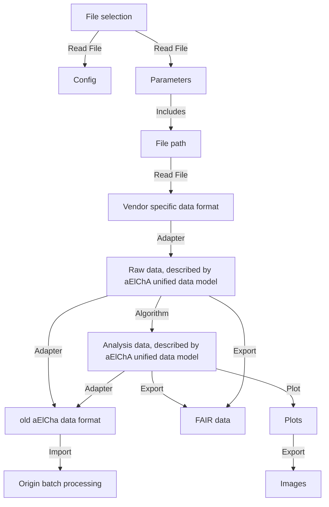
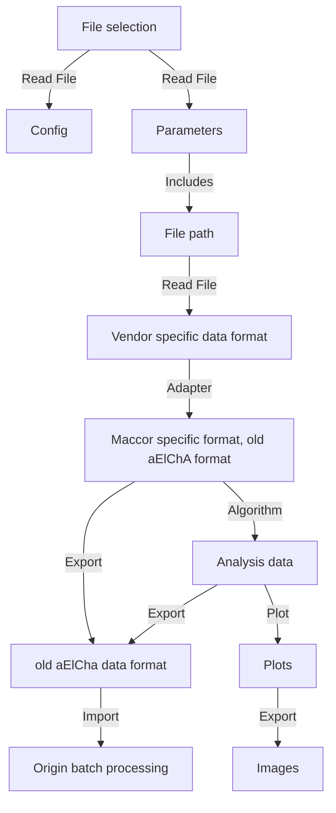
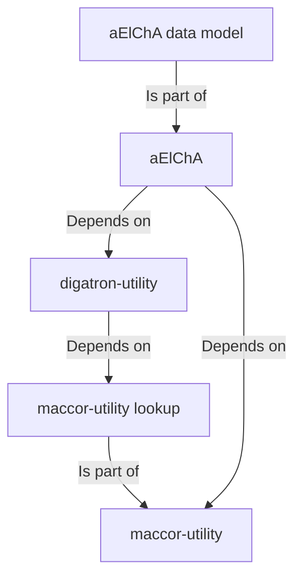
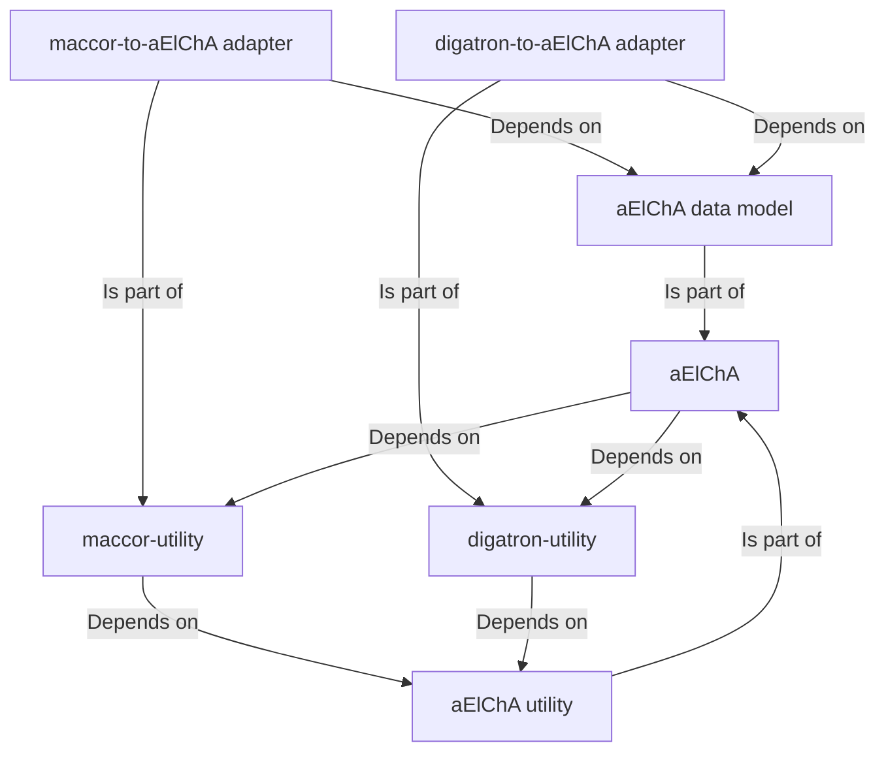

# aElChA Data Model

```mermaid
flowchart TD
    A[Maccor raw data format] -- Read Mac File --> C[Maccor unified data format]
    B[Maccor exported data format] -- Read Text File --> C
    C --Adapter--> D[aElChA unified data model]
    E[Digatron exported data] -- Read Text File --> F[Digatron unified data format]
    F --Adapter--> D
```

# aElChA Final Workflow

```mermaid
flowchart TD
    A[File selection] -- Read File --> B[Config]
    A -- Read File --> C[Parameters]
    C -- Includes --> D[File path]
    D -- Read File --> E[Vendor specific data format]
    E -- Adapter --> F[Raw data, described by aElChA unified data model]
    F -- Adapter --> K[old aElCha data format]
    F -- Algorithm --> G[Analysis data, described by aElChA unified data model]
    G -- Adapter --> K
    G -- Export --> H[FAIR data]
    F -- Export --> H[FAIR data]
    G -- Plot --> I[Plots]
    I -- Export --> J[Images]
    K -- Import --> L[Origin batch processing]
```

# aElChA Preliminary Workflow

```mermaid
flowchart TD
    A[File selection] -- Read File --> B[Config]
    A -- Read File --> C[Parameters]
    C -- Includes --> D[File path]
    D -- Read File --> E[Vendor specific data format]
    E -- Adapter --> F[Maccor specific format, old aElChA format]
    F -- Export --> K[old aElCha data format]
    F -- Algorithm --> G[Analysis data]
    G -- Export --> K
    G -- Plot --> I[Plots]
    I -- Export --> J[Images]
    K -- Import --> L[Origin batch processing]
```

# aElChA Dependencies (future)

```mermaid
flowchart TD
    B[aElChA]
    B[aElChA]
    BB[aElChA data model]
    BB -- Is part of --> B
    C[maccor-utility]
    CC[maccor-utility lookup]
    D[digatron-utility]
    CC -- Is part of --> C
    D -- Depends on --> CC
    B -- Depends on --> C
    B -- Depends on --> D
```

# aElChA Dependencies (future)

```mermaid
graph TD
    B[aElChA]
    BB[aElChA data model]
    BBB[aElChA utility]
    BB -- Is part of --> B
    BBB -- Is part of --> B
    C[maccor-utility]
    CC[maccor-to-aElChA adapter]
    CC -- Is part of --> C
    CC -- Depends on --> BB
    D[digatron-utility]
    DD[digatron-to-aElChA adapter]
    DD -- Is part of --> D
    DD -- Depends on --> BB
    C -- Depends on --> BBB
    D -- Depends on --> BBB
    B -- Depends on --> C
    B -- Depends on --> D
```
