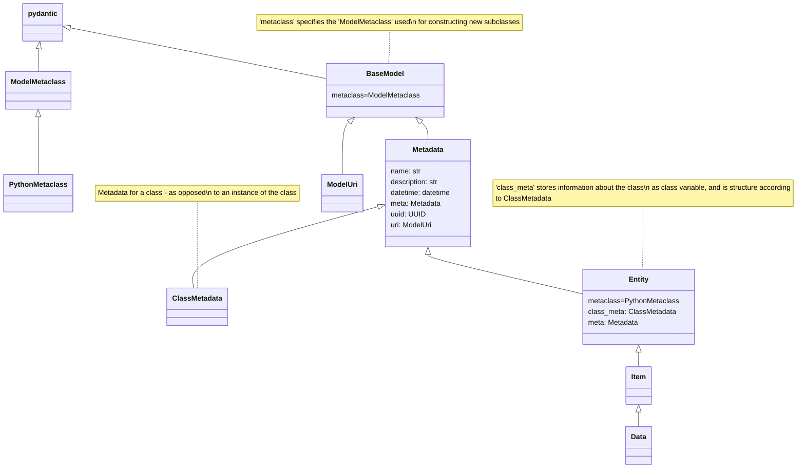

```mermaid
classDiagram
    class BaseModel {
        metaclass=ModelMetaclass
    }
    note for BaseModel "'metaclass' specifies the 'ModelMetaclass' used\n for constructing new subclasses"
    class ModelMetaclass {

    }
    class PythonMetaclass{
    }
    class Metadata {
        name: str
        description: str
        datetime: datetime
        meta: Metadata
        uuid: UUID
        uri: ModelUri
    }
    class ClassMetadata{
    }
    note for ClassMetadata "Metadata for a class - as opposed\n to an instance of the class "
    class Entity {
        metaclass=PythonMetaclass
        class_meta: ClassMetadata
        meta: Metadata
    }
    note for Entity "'class_meta' stores information about the class\n as class variable, and is structure according
    to ClassMetadata"

    pydantic <|-- BaseModel
    pydantic <|-- ModelMetaclass
    BaseModel <|-- Metadata
    BaseModel <|-- ModelUri
    ModelMetaclass <|-- PythonMetaclass
    Metadata <|-- Entity
    Metadata <|-- ClassMetadata
    Entity <|-- Item
    Item <|-- Data
```
