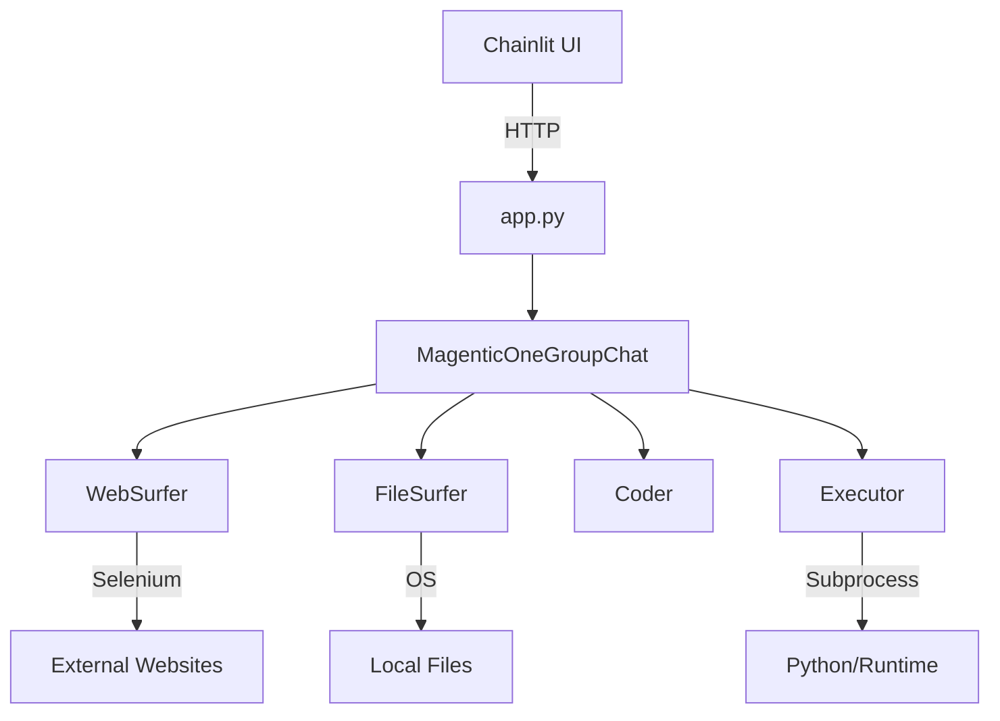

# AgenticFleet

A powerful multi-agent system for adaptive AI reasoning and automation. AgenticFleet combines Chainlit's interactive interface with AutoGen's multi-agent capabilities to create a flexible, powerful AI assistant platform.


[](https://app.codacy.com/gh/Qredence/AgenticFleet/dashboard?utm_source=gh&utm_medium=referral&utm_content=&utm_campaign=Badge_grade)


## Core Components

AgenticFleet operates through a coordinated team of specialized agents:

- **WebSurfer**: Expert web navigation agent
  - Extracts information from web pages
  - Captures and processes screenshots
  - Provides structured summaries of findings

- **FileSurfer**: File system specialist
  - Searches and analyzes workspace files
  - Manages file operations efficiently
  - Extracts relevant information from documents

- **Coder**: Development expert
  - Generates and reviews code
  - Implements solutions
  - Maintains code quality

- **Executor**: Code execution specialist
  - Safely runs code in isolated workspace
  - Monitors execution and handles timeouts
  - Provides detailed execution feedback

## Key Features

- **Multi-Agent System**
  - Coordinated team of specialized AI agents
  - Real-time inter-agent communication
  - Task planning and execution tracking
  
- **Interactive Interface**
  - Real-time streaming responses
  - Code syntax highlighting
  - Markdown rendering
  - File upload/download support
  - Progress visualization with task lists

- **Advanced Capabilities**
  - GitHub OAuth authentication
  - Configurable agent behaviors
  - Comprehensive error handling and recovery
  - Multi-modal content processing (text, images)
  - Execution workspace isolation
  
- **Developer-Friendly**
  - Easy-to-use CLI
  - Extensive documentation
  - Flexible configuration
  - Active community support

## Quick Start

1. Install AgenticFleet using uv (recommended):

```bash
uv pip install agentic-fleet
```

```bash
playwright install --with-deps chromium # Optional: Install Playwright Chromium dependencies
```

2. Copy and configure environment variables:

```bash
# Copy the example environment file
cp .env.example .env

# Open .env and update with your values
# Required: Add your Azure OpenAI credentials
# Optional: Configure OAuth settings
```

3. Start the server:

```bash
agenticfleet start   # Enable GitHub authentication
agenticfleet start --no-oauth # Default local mode
```

The web interface will be available at `http://localhost:8001`.

## System Architecture



## Configuration

The `.env.example` file contains all required and recommended settings:

```env
# Required: Azure OpenAI Configuration
AZURE_OPENAI_API_KEY=your_api_key
AZURE_OPENAI_ENDPOINT=your_endpoint
AZURE_OPENAI_DEPLOYMENT=your_deployment
AZURE_OPENAI_MODEL=your_model

# Optional: OAuth Configuration
USE_OAUTH=false
OAUTH_GITHUB_CLIENT_ID=
OAUTH_GITHUB_CLIENT_SECRET=
OAUTH_REDIRECT_URI=http://localhost:8001/oauth/callback
```

## Error Handling

AgenticFleet implements comprehensive error handling:

- Graceful degradation on service failures
- Detailed error logging and reporting
- Automatic cleanup of resources
- Session state recovery
- Execution timeout management

## Development

### Prerequisites

- Python 3.10-3.12 (Python 3.13 is not yet supported)
- uv package manager (recommended)
- Azure OpenAI API access

### Setup

1. Clone and install:

```bash
git clone https://github.com/qredence/agenticfleet.git
cd agenticfleet
pip install uv
uv pip install -e .
uv pip install -e ".[dev]"

```

2. Run tests:

```bash
pytest tests/
```

## Documentation

- [Installation Guide](docs/installation.md) - Detailed setup instructions
- [Usage Guide](docs/usage-guide.md) - How to use AgenticFleet
- [API Reference](docs/api-reference.md) - Complete API documentation
- [Architecture Overview](docs/agentic-fleet.md) - System architecture and design

## Contributing

We welcome contributions! Please see our [Contributing Guide](CONTRIBUTING.md) for details.

## Security

For security concerns, please review our [Security Policy](SECURITY.md).

## License

This project is licensed under the Apache-2.0 License - see the [LICENSE](LICENSE) file for details.

## Support

- [Issue Tracker](https://github.com/qredence/agenticfleet/issues)
- [Discussions](https://github.com/qredence/agenticfleet/discussions)
- Email: <contact@qredence.ai>

## Star History

[](https://star-history.com/#Qredence/AgenticFleet&Date)
