```mermaid
architecture-beta
    group api(logos:aws-lambda)[API]

    service db(logos:aws-aurora)[Database] in api
    service disk1(logos:aws-glacier)[Storage] in api
    service disk2(logos:aws-s3)[Storage] in api
    service server(logos:aws-ec2)[Server] in api

    db:L -- R:server
    disk1:T -- B:server
    disk2:T -- B:db
```

# pandoc-mermaid-selenium-filter

[](https://pypi.org/project/pandoc-mermaid-selenium-filter/)
[](https://pypi.org/project/pandoc-mermaid-selenium-filter/)
[](https://github.com/itTkm/pandoc-mermaid-selenium-filter/blob/main/LICENSE)
[](https://github.com/itTkm/pandoc-mermaid-selenium-filter/actions/workflows/test.yml?query=branch%3Amain)
[](https://coveralls.io/github/itTkm/pandoc-mermaid-selenium-filter?branch=main)

Provides a feature available as a [filter] for the widely known universal document conversion tool [Pandoc], which converts code blocks written in [Mermaid] syntax within Markdown documents into images.

Supports [Architecture Diagrams] introduced in Mermaid v11.1.0. Additionally, icon sets from [iconify.design], including [SVG Logos] and [Material Design Icons], are available for use.

The conversion process follows these steps:

1. Detect code blocks with the `mermaid` class specified
2. Convert the detected Mermaid syntax code to PNG images using [Selenium]
3. Save the generated images in the `mermaid-images` directory and replace the original code blocks with image references

Although many similar filters with the same functionality are already available, most of them rely on packages using [Puppeteer] as the image conversion engine. These packages often face dependency issues or have challenges related to complex setup and configuration. This package adopts [Selenium], which has a longer history than Puppeteer.

> [!NOTE]
>
> - [Chrome WebDriver] will be downloaded on first execution
> - A headless Chrome browser is temporarily used for image generation

[pandoc]: https://pandoc.org/
[filter]: https://pandoc.org/filters.html
[Mermaid]: https://mermaid.js.org/
[Architecture Diagrams]: https://mermaid.js.org/syntax/architecture.html
[iconify.design]: https://iconify.design/
[SVG Logos]: https://icon-sets.iconify.design/logos/
[Material Design Icons]: https://icon-sets.iconify.design/mdi/
[Selenium]: https://www.selenium.dev/
[Puppeteer]: https://pptr.dev/
[Chrome WebDriver]: (https://developer.chrome.com/docs/chromedriver?hl=ja)

## Usage

1. First, install the filter.

   ```bash
   pip install pandoc-mermaid-selenium-filter
   ```

2. When using Mermaid syntax in your Markdown file, use a code block with the `mermaid` class specified as follows:

   ````markdown
   # Testing Mermaid Filter

   Here's a simple flowchart example:

   ```mermaid
   graph TD
       A[Start] --> B{Condition}
       B -->|Yes| C[Process 1]
       B -->|No| D[Process 2]
       C --> E[End]
       D --> E
   ```
   ````

3. You can convert Markdown to HTML/PDF using the following commands:

   ```bash
   # HTML
   pandoc example/example.md \
      --filter pandoc-mermaid-selenium-filter \
      -o example/output.html

   # PDF
   pandoc example/example.md \
      --filter pandoc-mermaid-selenium-filter \
      -o example/output.pdf
   ```

> [!NOTE]
>
> For generating PDFs with Japanese text, add the following options.
> Note that you need to install `collection-langjapanese` beforehand to add Japanese support to Pandoc.
>
> ```bash
> pandoc example/example.md \
>    --filter pandoc-mermaid-selenium-filter \
>    -o example/output.pdf \
>    --pdf-engine lualatex \
>    -V documentclass=ltjarticle \
>    -V luatexjapresetoptions=fonts-noto-cjk
> ```

## Architecture Diagrams

In the context of mermaid-js, the architecture diagram is used to show the relationship between services and resources commonly found within the Cloud or CI/CD deployments. In an architecture diagram, services (nodes) are connected by edges. Related services can be placed within groups to better illustrate how they are organized.

The example code as follows:

````markdown

````

## Icons

By default, architecture diagram supports the following icons: `cloud`, `database`, `disk`, `internet`, `server`. This package provides access to the [SVG Logos] and [Material Design Icons] icon sets offered by [iconify.design]. They can be used in the architecture diagram by using the format `logos:icon-name` or `mdi:icon-name`.

The example code will change as follows:

````markdown

````

## Developer Information

### Development Environment Setup

You can install all development dependencies with the following command:

```bash
uv sync --extra dev
```

### Build

You can build this package using the following command. During the build process, the custom hooks will download the latest source code for [Mermaid], as well as the [SVG Logos] and [Material Design Icons] icon sets, from [jsDelivr].

[jsDelivr]: https://www.jsdelivr.com/

```bash
uv build
```

### Testing

You can run tests with the following command:

```bash
uv run pytest
```

## License

This library is licensed under the [MIT License](https://github.com/itTkm/pandoc-mermaid-selenium-filter/blob/main/LICENSE).
