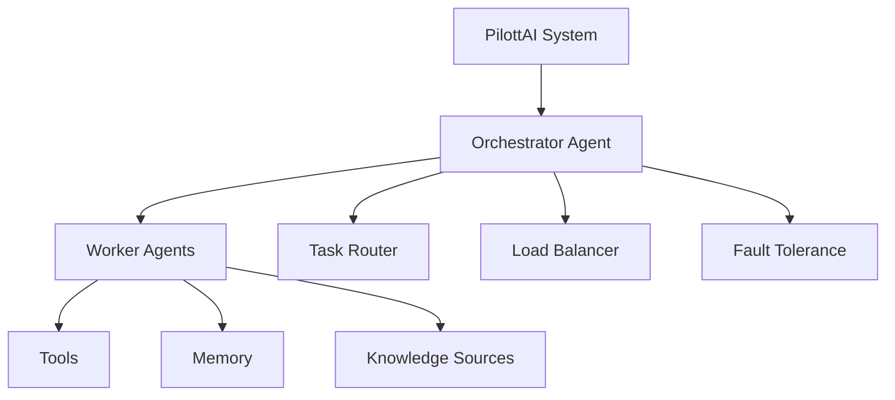

# 🤖 PilottAI Framework

<div align="center">
  <picture>
    <source media="(prefers-color-scheme: dark)" srcset="https://raw.githubusercontent.com/anuj0456/pilottai/main/interface/assets/logo.png">
    <source media="(prefers-color-scheme: light)" srcset="https://raw.githubusercontent.com/anuj0456/pilottai/main/interface/assets/logo.png">
    
  </picture>
  <h3>Build Intelligent Multi-Agent Systems with Python</h3>
  <p><em>Scale your AI applications with orchestrated autonomous agents</em></p>
</div>

<div align="center">
  
[](https://badge.fury.io/py/pilott)
[](https://opensource.org/licenses/MIT)
[](https://www.python.org/downloads/)
[](https://pilottai.readthedocs.io)
[](https://github.com/psf/black)

[//]: # ([![Downloads]&#40;https://pepy.tech/badge/pilott&#41;]&#40;https://pepy.tech/project/pilott&#41;)


</div>

## 🌟 Why PilottAI?

PilottAI is a modern Python framework that simplifies building complex multi-agent systems. Whether you're developing autonomous AI applications, distributed task processors, or intelligent automation systems, PilottAI provides the building blocks you need.

### Key Features

🚀 **Advanced Agent Architecture**
- Hierarchical multi-agent system with manager and worker agents
- Built-in task orchestration and intelligent routing
- Flexible agent communication patterns
- Memory management and context preservation

⚡ **Enterprise-Ready Performance**
- Asynchronous task processing
- Dynamic scaling based on workload
- Intelligent load balancing
- Fault tolerance and automatic recovery

🔌 **Seamless Integration**
- Native support for LLM providers (OpenAI, Anthropic)
- Extensible tool system
- Built-in PDF and document processing
- WebSocket support for real-time communication

🛡️ **Production-Grade Reliability**
- Comprehensive logging and monitoring
- Error handling and recovery mechanisms
- Resource management and optimization
- Production-ready configuration system

## 🚀 Quick Start

### Installation

```bash
pip install pilott
```

### Basic Usage

```python
from pilott import Serve
from pilott.core import AgentConfig, AgentRole

# Configure your agent
config = AgentConfig(
    role="processor",
    role_type=AgentRole.WORKER,
    goal="Process incoming tasks efficiently",
    description="Task processing worker"
)

# Initialize PilottAI system
pilott = Serve(
    name="TaskProcessor",
    verbose=True
)

# Run your system
async def main():
    # Start the system
    await pilott.start()
    
    # Add an agent
    agent = await pilott.add_agent(
        agent_type="processor",
        config=config
    )
    
    # Execute a task
    result = await pilott.execute_task({
        "type": "process",
        "data": {"key": "value"}
    })
    
    # Cleanup
    await pilott.stop()
```

## 🏗️ System Architecture



## 📚 Documentation

Visit our comprehensive documentation:
- [Getting Started Guide](https://pilottai.readthedocs.io/getting-started)
- [Core Concepts](https://pilottai.readthedocs.io/concepts)
- [API Reference](https://pilottai.readthedocs.io/api)
- [Examples & Tutorials](https://pilottai.readthedocs.io/examples)

## 🤝 Contributing

We welcome contributions! See our [Contributing Guide](CONTRIBUTING.md) for:
- Development setup
- Coding standards
- Testing requirements
- Pull request process

## 📫 Community & Support

- 💬 [Discord Community](https://discord.gg/pilottai)
- 📝 [GitHub Discussions](https://github.com/pilottai/pilott/discussions)
- 🐦 [Twitter Updates](https://twitter.com/pilottai)
- 📧 [Email Support](mailto:support@pilottai.com)

## 📄 License

PilottAI is MIT licensed. See the [LICENSE](LICENSE) file for details.

---

<div align="center">
  <sub>Built with ❤️ by the PilottAI Team</sub>
</div>